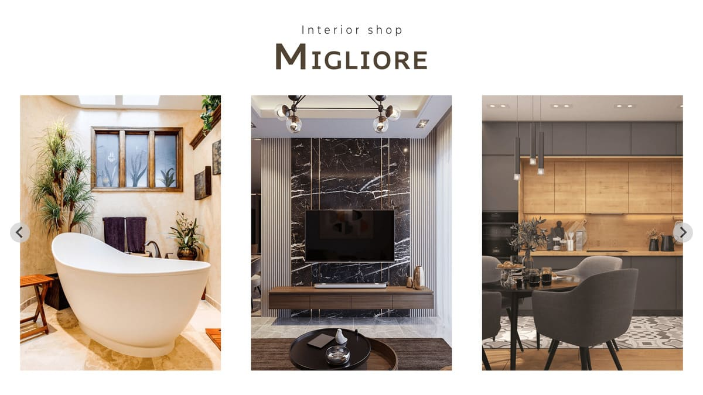

# Web サイト：MIGLIORE



## 概要

Hello Mentor のコーディング課題として制作した、架空のインテリアショップ「MIGLIORE」の Web サイトです。  
提供された Figma デザインカンプをもとに、デザイン再現性を意識してコーディングを行いました。

## URL

https://portfolio.itsseiya.com/migliore/

## 使用技術

-   HTML5 / CSS3
-   Splide.js(https://splidejs.com/)（スライダーライブラリ）

## 工夫した点

-   Splide.js を使ってスライダーを実装
-   再利用性、保守性を考慮した CSS 設計
-   レスポンシブ対応に配慮し、スマホ・タブレットでもレイアウトが崩れないよう調整

## ローカルでの確認方法

```bash　　　
git clone https://github.com/seiyaie/migliore.git
```
